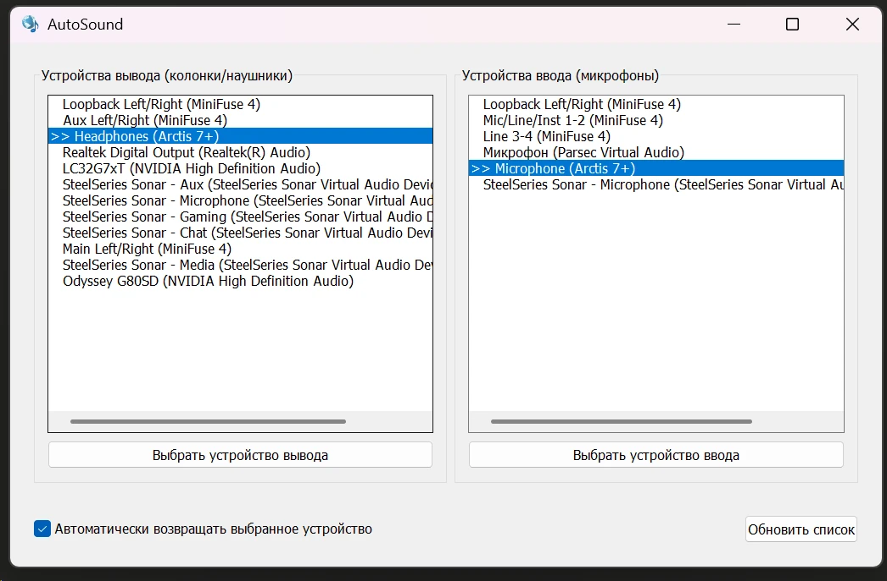

# AutoSound

**AutoSound** — утилита для Windows, которая автоматически управляет аудиоустройствами и не позволяет системе самовольно переключать их.



## Возможности

- **Выбор устройства вывода** — колонки, наушники, виртуальные аудиоустройства
- **Выбор устройства ввода** — микрофоны
- **Автоматическое восстановление** — если Windows или другая программа переключит аудиоустройство, AutoSound мгновенно вернёт ваш выбор
- **Работа в системном трее** — программа запускается свёрнутой и не мешает работе
- **Сохранение настроек** — выбранные устройства сохраняются и восстанавливаются при перезапуске

## Установка

### Из релизов

Скачайте `AutoSound.exe` из [Releases](https://github.com/Gidroponik/AutoSoundWindows/releases/tag/Release) и запустите.

### Сборка из исходников

Требования:
- Go 1.21+
- Windows 10/11

```bash
# Клонируйте репозиторий
git clone https://github.com/YOUR_USERNAME/AutoSound.git
cd AutoSound

# Установите инструмент для ресурсов
go install github.com/akavel/rsrc@latest

# Сгенерируйте ресурсы Windows
rsrc -manifest AutoSound.manifest -o rsrc.syso

# Соберите приложение
go build -ldflags="-H windowsgui" -o AutoSound.exe .
```

## Использование

1. Запустите `AutoSound.exe` — программа появится в системном трее
2. Кликните по иконке в трее, чтобы открыть окно
3. Выберите нужное устройство вывода (слева) и ввода (справа)
4. Нажмите кнопку **"Выбрать устройство"** или сделайте двойной клик
5. Включите галочку **"Автоматически возвращать выбранное устройство"** чтобы программа следила за переключениями

### Маркеры в списке

- `>>` — ваше выбранное устройство
- `*` — текущее системное устройство по умолчанию

### Контекстное меню трея

- **Показать** — открыть окно программы
- **Обновить устройства** — обновить список аудиоустройств
- **Выход** — закрыть программу

## Автозапуск

Чтобы программа запускалась вместе с Windows:

1. Нажмите `Win + R`, введите `shell:startup`
2. Создайте ярлык на `AutoSound.exe` в открывшейся папке

## Настройки

Настройки сохраняются в файле:
```
%APPDATA%\AutoSound\settings.json
```

## Технологии

- **Go** — язык программирования
- **Walk** — библиотека для Windows GUI
- **Windows Core Audio API** — управление аудиоустройствами

## Лицензия

MIT License
