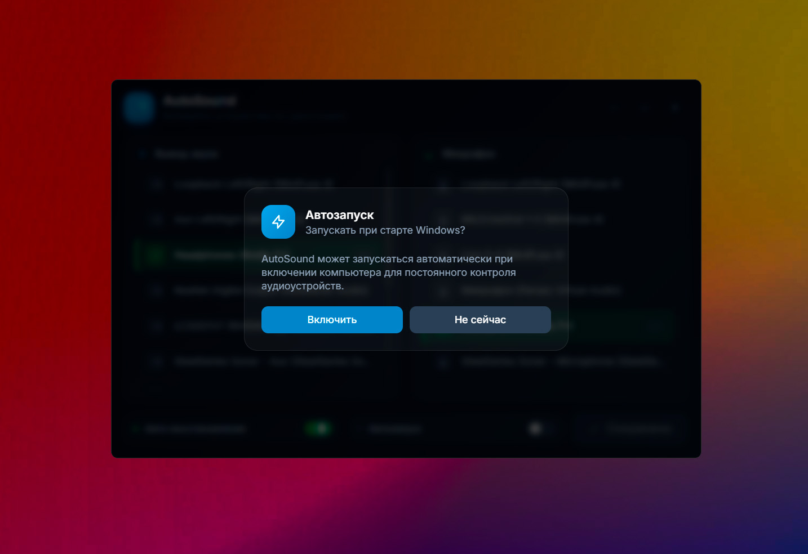
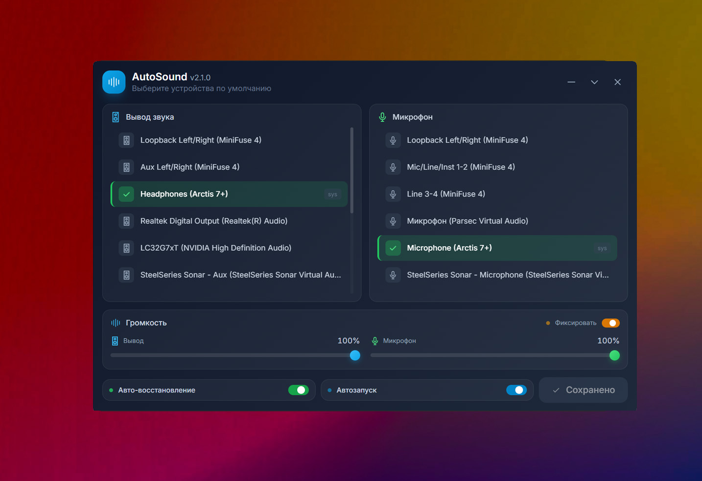

# AutoSound v2.1.0

**AutoSound** — утилита для Windows, которая автоматически управляет аудиоустройствами и громкостью, не позволяя системе самовольно изменять их.




## Возможности

- **Современный интерфейс** — frameless окно с кастомным дизайном на Tailwind CSS
- **Выбор устройства вывода** — колонки, наушники, виртуальные аудиоустройства
- **Выбор устройства ввода** — микрофоны
- **Управление громкостью** — отдельные ползунки для вывода и микрофона
- **Фиксация громкости** — защита от изменения громкости системой или другими программами
- **Автоматическое восстановление** — если Windows или другая программа переключит аудиоустройство, AutoSound мгновенно вернёт ваш выбор
- **Автозапуск** — встроенное управление автозагрузкой Windows
- **Работа в системном трее** — программа запускается свёрнутой и не мешает работе
- **Сохранение настроек** — выбранные устройства и громкость сохраняются в JSON

## Установка

### Из релизов

Скачайте `AutoSound.exe` из [Releases](https://github.com/Gidroponik/AutoSoundWindows/releases/tag/v2.1.0) и запустите.

### Сборка из исходников

Требования:
- Go 1.21+
- Wails CLI v2
- Windows 10/11

```bash
# Клонируйте репозиторий
git clone https://github.com/Gidroponik/AutoSoundWindows.git
cd AutoSoundWindows

# Установите Wails CLI
go install github.com/wailsapp/wails/v2/cmd/wails@latest

# Соберите приложение
wails build
```

Готовый exe будет в `build/bin/AutoSound.exe`

## Использование

1. Запустите `AutoSound.exe`
2. При первом запуске программа предложит добавить себя в автозагрузку
3. Кликните по устройству в списке чтобы выбрать его
4. Настройте громкость с помощью ползунков
5. Нажмите **"Сохранить"** для применения изменений
6. Включите **"Авто-восстановление"** чтобы программа следила за переключениями

### Индикаторы устройств

- **Зелёная галочка** — сохранённое устройство
- **Синяя точка** — выбрано, но ещё не сохранено
- **sys** — текущее системное устройство по умолчанию

### Управление окном

- **—** Свернуть окно
- **∨** Скрыть в трей
- **×** Закрыть приложение

### Панель громкости

- **Ползунок "Вывод"** — громкость устройства воспроизведения (0-100%)
- **Ползунок "Микрофон"** — громкость устройства записи (0-100%)
- **Фиксировать** — включите, чтобы система не могла изменить громкость

### Нижняя панель

- **Авто-восстановление** — автоматически возвращать выбранное устройство при переключении
- **Автозапуск** — запускать программу вместе с Windows
- **Сохранить** — применить выбранные устройства

## Настройки

Настройки сохраняются в файле:
```
%APPDATA%\AutoSound\settings.json
```

Автозапуск управляется через реестр Windows:
```
HKEY_CURRENT_USER\Software\Microsoft\Windows\CurrentVersion\Run
```

## Технологии

- **Go** — язык программирования
- **Wails v2** — фреймворк для десктопных приложений
- **Tailwind CSS** — стилизация интерфейса
- **Windows Core Audio API** — управление аудиоустройствами

## Changelog

### v2.1.0
- Добавлены ползунки громкости для устройств вывода и микрофона
- Добавлена функция "Фиксировать громкость" — защита от изменения системой
- Громкость отображается в процентах в реальном времени
- Настройки громкости сохраняются в JSON
- Автоматическое восстановление громкости при внешних изменениях
- Улучшен дизайн интерфейса

### v2.0.0
- Полностью переработан интерфейс
- Frameless окно с кастомными кнопками управления
- Перетаскивание окна за заголовок
- Добавлена модалка с предложением автозапуска при первом запуске
- Добавлен переключатель автозапуска в интерфейсе
- Логика "выбрать → сохранить" вместо мгновенного применения
- Улучшены иконки устройств
- Программа запускается скрытой в трее

### v1.0.0
- Первый релиз
- Windows Forms интерфейс
- Базовое управление аудиоустройствами

## Лицензия

MIT License
